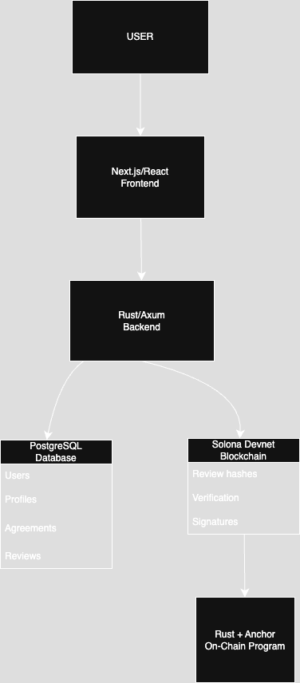

# TrustLayer — Project Milestone 1

## 1. Working application and repository

- Repository: https://github.com/JTanner04/trustlayer
- Deployment URL: not deployed; the MVP is run locally using the instructions below.
- Main application URLs after local startup:
  - Frontend: `http://localhost:3000`
  - API health check: `http://127.0.0.1:3001/health`

TrustLayer is a web application for building a verifiable reputation from
completed work agreements and peer reviews. It supports two users completing a
shared workflow: create an agreement, accept it, complete it, submit a review,
and inspect its verification record.

## 2. Updated requirements

| ID | MVP requirement | Implemented behavior |
| --- | --- | --- |
| R1 | Registration and login | Users register with email, display name, and a 12+ character password. Passwords are hashed with bcrypt; login creates an HttpOnly session cookie. |
| R2 | User profiles | Each user has a display name, bio, optional public wallet address, and public reputation profile. |
| R3 | Agreements | An authenticated user creates an agreement by entering another user's ID, title, and description. |
| R4 | Agreement consent and completion | Only the invited participant can accept an open agreement. After acceptance, either participant can complete it. |
| R5 | Reviews | After completion, each participant can submit one 1–5 rating and review for the other participant. |
| R6 | Reputation profiles | The profile and dashboard display completed work, received reviews, ratings, and verification state. |
| R7 | Blockchain verification | When Devnet configuration is supplied, review metadata is hashed and recorded in a Solana Memo transaction; its confirmed signature is saved with the review. |
| R8 | Verification visibility | Review pages show `verified` or `failed` status and link verified transactions to Solana Explorer. |

The following are intentionally outside the Milestone 1 MVP: cryptocurrency
payments, NFTs, messaging, mobile application, AI fraud detection,
multi-blockchain support, and advanced dispute resolution.

## 3. Updated design and architecture



### Components

| Component | Responsibility |
| --- | --- |
| Next.js frontend | Registration/login screens and the authenticated dashboard, profile, agreement, review, and verification pages. |
| Next.js server routes | Forward authenticated browser requests to Axum while keeping the JWT in an HttpOnly cookie. |
| Rust/Axum API | Enforces authentication, agreement state transitions, review eligibility, profile access, and verification submission. |
| PostgreSQL | Persists users, profiles, agreements, acceptance/completion timestamps, reviews, and verification results. |
| Solana Devnet | Stores a SHA-256 digest of non-sensitive review metadata using the Memo program. |

### Data and security decisions

- Passwords are bcrypt hashes; plaintext passwords are never stored.
- The browser never receives the backend JWT directly; Next.js stores it in an
  HttpOnly cookie and forwards it server-side.
- Agreement completion is blocked until acceptance, and review creation is
  blocked until completion. A database uniqueness constraint allows one review
  per reviewer per agreement.
- The on-chain memo contains only a hash derived from IDs and rating. Review
  text, email addresses, passwords, seed phrases, and private keys are not
  written to Solana.
- The Solana signer is optional. When it is absent or a Devnet transaction
  fails, review creation succeeds but its verification status is `failed`.

## 4. Setup and run instructions

### Required software

- Node.js 20+ and npm
- Rust stable toolchain with Cargo
- PostgreSQL 15+
- Optional for live blockchain records: Solana CLI plus a funded **Devnet-only**
  keypair outside the repository

### Database and migrations

Start PostgreSQL and create an empty database:

```sh
createdb trustlayer
```

The API applies `axum-api/migrations/0001_initial.sql` and
`axum-api/migrations/0002_agreement_acceptance.sql` automatically on startup.
No seed data is required: create two accounts through the application for the
end-to-end flow.

### Start the backend

```sh
cd axum-api
export DATABASE_URL='postgres://<postgres-user>:<postgres-password>@localhost:5432/trustlayer'
export JWT_SECRET="$(openssl rand -hex 32)"
cargo run
```

Replace the database URL with local PostgreSQL credentials. Confirm startup:

```sh
curl http://127.0.0.1:3001/health
```

Expected response:

```json
{"status":"ok"}
```

### Optional Solana Devnet configuration

Before running the backend, set these variables only when live verification is
being demonstrated:

```sh
export SOLANA_RPC_URL='https://api.devnet.solana.com'
export SOLANA_KEYPAIR_PATH='/absolute/path/outside/the/repository/devnet-keypair.json'
```

The keypair must be Devnet-only and have sufficient Devnet SOL for transaction
fees. Never commit a keypair JSON file, seed phrase, local `.env` file, or real
JWT secret.

### Start the frontend

In a second terminal:

```sh
cd frontend
npm install
npm run dev
```

Open `http://localhost:3000`. The frontend expects the API at
`http://127.0.0.1:3001` by default. To use a different API address, create the
ignored `frontend/.env.local` with:

```env
TRUSTLAYER_API_URL=http://127.0.0.1:3001
```

## 5. TA verification instructions

1. Clone the repository and follow the setup instructions above.
2. Visit `http://127.0.0.1:3001/health`; verify it returns `{"status":"ok"}`.
3. Open `http://localhost:3000` and register **Account A**. In Profile Settings,
   copy Account A's user ID.
4. In a private/incognito browser window, register **Account B** and copy its
   user ID from Profile Settings.
5. As Account A, create an agreement using Account B's user ID.
6. As Account B, open that agreement and select **Accept agreement**. Verify
   that the acceptance action is no longer offered and completion is available.
7. As either account, select **Mark complete**, then confirm completion. Verify
   that the agreement status changes to `Completed`.
8. As Account A, open the completed agreement and submit a rating and written
   review for Account B. Verify it appears under Account B's received reviews
   and Account A's given reviews.
9. Optional blockchain check: with the Devnet variables configured, open the
   review verification page. Verify status is `Verified`, a transaction
   signature is present, and its Solana Explorer link opens. Without a signer,
   verify that the status accurately displays `Failed` instead.
10. Visit `http://127.0.0.1:3001/profiles/<ACCOUNT_B_USER_ID>` in a browser or
    with `curl`. Verify the public response contains Account B's profile and
    received review information.

## 6. MVP demonstration

Record a short demonstration of the same flow in the TA verification steps:

1. Register/login two accounts.
2. Create, accept, and complete an agreement.
3. Submit a review.
4. Show the updated reputation profile API response and review verification state.
5. If Devnet is enabled, open the transaction in Solana Explorer.

Demo video link: **https://youtu.be/cz4yWrr2Zdo**

## 7. Team contributions

- **Jeremiah Tanner:** Developed the Rust/Axum backend, PostgreSQL database and migrations, authentication system, agreement and review APIs, and Solana Devnet verification integration. Also connected the backend to the frontend and prepared the project’s setup, security, and TA verification documentation.
- **Jailin West:** Worked with react and next.js to build out a front end shell with a homepage for a general information on the sight, a login & signup page, a dashboard page, as-well as profile page etc. These pages work as the user facing side where users can setup account connect their wallets and be able to view and manage their agreements properly. This is later connected to the backend with is the work engine behind the UI/UX that gives the site an overall inviting feel.